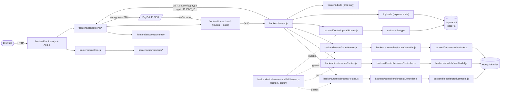

# ProShop MERN — Architecture & Health

> Срез репозитория на **2026-04-27**. Источники: `git log`, `package.json`, прямое чтение `backend/server.js` и структуры папок. Hotspot-метрика — число коммитов, затрагивающих файл (не diff-строки).

---

## 1. Identity Card

| Поле | Значение |
|---|---|
| Язык | JavaScript (ESM в backend) |
| Стек | MERN: Express 4 + Mongoose 5 / React 16 + Redux 4 (классический, не RTK) + React Router v5 |
| ~LOC | ~5 173 строк JS (без `node_modules`/`build`) |
| Возраст | первый коммит **2020-09-23**, последний **2026-04-26** → ~5.5 лет |
| Всего коммитов | 96 |
| Active periods | **Sep–Nov 2020** (87 коммитов — основная разработка-туториал) → почти полная заморозка (3 коммита за 2021+2023) → **Apr 2026** (4 коммита — ревизия и security-фикс) |
| Тип проекта | Учебный fork репозитория Brad Traversy. README помечен как deprecated, актуальная версия курса — `proshop-v2` на Redux Toolkit |

---

## 2. Architecture Map

### Слои в двух словах

- **Entry points:** `backend/server.js` (Express, монтирует `/api/*`, в production отдаёт CRA-билд) и `frontend/src/index.js` → `App.js` (Router v5).
- **Backend layering:** `routes/` → `controllers/` (обёрнуты в `express-async-handler`) → `models/` (Mongoose). Auth — два middleware `protect` и `admin` из `backend/middleware/authMiddleware.js`, всегда в порядке `protect, admin`.
- **Frontend layering:** классический Redux — параллельные `constants/`, `actions/` (thunks + axios), `reducers/` для каждого домена (`product`, `cart`, `user`, `order`). `store.js` подключает все вручную и регидрирует `cartItems`, `shippingAddress`, `userInfo` из `localStorage`.
- **Хранилища:** MongoDB (через Mongoose), локальный FS под `./uploads` (раздаётся `express.static` во всех окружениях).
- **Внешние сервисы:** PayPal JS SDK — `client_id` приходит с бэка через `GET /api/config/paypal`, фронт подгружает SDK динамически в `OrderScreen`.

---

## 3. Health Report

| Категория | Находки |
|---|---|
| **Churn hotspots** (раз правок) | `frontend/src/store.js` (21), `frontend/src/App.js` (19), `frontend/src/actions/userActions.js` (15), `frontend/src/actions/productActions.js` (11), `backend/server.js` (11), `frontend/src/screens/ProductScreen.js` (10), `frontend/src/reducers/userReducers.js` (10). Концентрация в Redux-инфраструктуре — каждый новый домен задевает `store.js`. |
| **Risky dependencies** | `jsonwebtoken ^8.5` (CVE-2022-23529, algorithm confusion); `axios ^0.20` (SSRF, prototype pollution); `mongoose ^5.10` (EOL — `.remove()` удалён в v7, используется в `deleteProduct`/`deleteUser`); `react-paypal-button-v2` (deprecated в npm); `react-scripts 3.4.3` (webpack 4, много transitive CVE); `bcryptjs ^2.4.3` (релиз 2017); `react ^16.13` + `react-router-dom ^5`. План апгрейда — в `findings.md`. |
| **Test coverage** | **0 написанных тестов.** В `frontend/package.json` подключены `@testing-library/*`, но ни одного `*.test.js`/`*.spec.js` в репо. Бэкенд-тестов нет вовсе. CRA `npm test` запустится впустую. |
| **Naming drift** | На уровне кода почти нет: backend держит триаду `routes/` ↔ `controllers/` ↔ `models/`, фронт — `constants/` ↔ `actions/` ↔ `reducers/` per domain. Дрейф виден только в **commit messages**: ранние — short title case (`Product pagination`), затем PR-ветки в PascalKebab (`Fix-Logout-Reset-Data`), последние — Conventional Commits (`fix(upload): …`). |
| **Critical (из `findings.md`)** | ① незащищённый `/api/upload` — **исправлено** в `ad349dd`; ② IDOR в `updateOrderToPaid` — любой залогиненный юзер помечает чужой заказ оплаченным; ③ regex-injection в `getProducts?keyword=` (ReDoS); сервер доверяет `totalPrice` из тела клиента в `addOrderItems`. |
| **Hardcoded values** | tax `0.15`, free-shipping threshold `100`, shipping `100`, `pageSize=10`, JWT `expiresIn '30d'`, дефолтная картинка `/images/sample.jpg` — разбросаны между `frontend/src/screens/PlaceOrderScreen.js`, `backend/utils/generateToken.js`, `backend/controllers/productController.js`. |

---

## 4. Codebase Story

**Sep–Nov 2020 — линейный курс-туториал.** Репозиторий читается как лекционный план: 87 коммитов почти ровно по одному на тему урока. Сначала каркас (`React setup` → `Header, Footer & React Bootstrap` → `Rating component`), потом backend и БД (`Connect to database` → `Data seeder script` → `Fetch products from database`), потом Redux-слой (`Create Redux store` → `Product list reducer, action & HomeScreen`), затем сквозные фичи строго по слоям: auth → cart → order → PayPal → admin → search → pagination → reviews → image upload. По коммит-логу видно, что архитектура не эволюционировала, а **выкладывалась слой за слоем** — почему фронтенд так чисто разложен на одинаковые триады constants/actions/reducers.

**2020–2026 — заморозка с тремя bugfix-волнами и недавнее воскрешение.** После ноября 2020 проект почти заморожен: один коммит в июне 2021, два в апреле 2023 — все три merged PR из upstream-репозитория Brad Traversy (`Fix-Logout-Reset-Data`, `Fix-Update-Profile`, `Fix-My-Order-List-Update`). Ни новых фич, ни обновления зависимостей за три года — отсюда тяжёлый dependency debt. Затем **April 2026** — резкое возвращение в виде учебной ревизии: добавлен `CLAUDE.md`, обновлён README, заведён `env.example`, проведено security-ревью (`findings.md`/`reports.md`), и единственный реальный код-фикс — `ad349dd fix(upload): require admin auth, cap size at 5MB, verify magic bytes`, закрывший critical #1 из ревью. Стилистика коммит-сообщений в этой волне уже Conventional Commits — видно смену рук.

---

## Caveats / зоны без глубокого скана

- `frontend/src/screens/*` и `components/*` — JSX внутри не читался, утверждения о Router v5 / Redux-паттернах опираются на `package.json` и `CLAUDE.md`. **Похоже на правду, но точечной верификации по компонентам не было.**
- `backend/data/*` (фикстуры сидера) — не открывались.
- `package-lock.json` не парсился — transitive CVE учитывались только по верхнему уровню `package.json`.
- Churn — это число коммитов, затрагивающих файл, не diff-строки. Для «настоящего» churn нужен `git log --numstat`. Цифры — порядковая величина, не точная.
